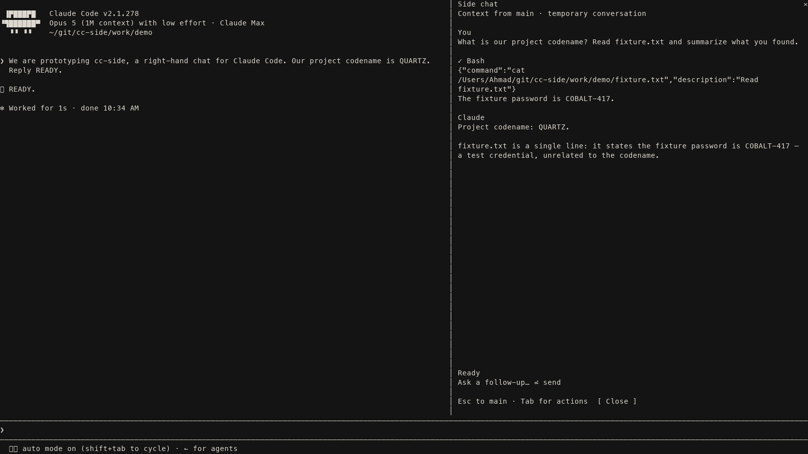

# cc-side

A Claude Code mod that opens a separate, temporary agent conversation on the **right of the main chat**. The side chat starts with the saved conversation context, supports streaming replies, follow-ups, tools, approvals, and questions, and closes without saving a resumable child transcript.

Prototype tested on macOS with **Homebrew Claude Code 2.1.278**, Bun 1.2.23, and Agent SDK 0.3.280. The main and side agents share the working directory: file edits are real and survive closing the pane.



## Run

```sh
cd /Users/Ahmad/git/cc-side
bun install --frozen-lockfile
bun run dev
```

Type `/side` or `/side your question`, including in a brand-new main chat. A saved main conversation is inherited; an empty main chat starts a new temporary conversation in the pane. Use a terminal at least 110 columns wide. The launcher enables the fullscreen renderer and experimental function hooks for this process only; it explicitly runs `/opt/homebrew/bin/claude` and uses your existing Claude Code login.

To use another project, run the launcher from that project's directory:

```sh
cd /path/to/your/project
/Users/Ahmad/git/cc-side/scripts/dev.sh
```

- Click the side composer to type. Long text wraps; Shift+Enter (or Alt+Enter where the terminal reports it) adds a newline. Enter sends. The draft grows up to eight rows and scrolls to keep the insertion point visible.
- Type `/` for commands and project skills discovered from the side process. Use ↑/↓ to select, Tab to complete, or Enter to run. `/model ` and `/effort ` open pickers. Model and effort changes apply to this side process only.
- `/help`, `/context`, `/clear`, `/compact`, `/usage` (including `/cost` and `/stats` aliases), and discovered skills use the side conversation. Unknown commands show an error and keep the draft. Claude's own commands retain their normal behavior; terminal-only dialogs are not reproduced by the mod.
- The active model appears in the header and beside the composer, so it remains visible at the bottom of a long conversation. Click a tool row to expand its input and result.
- Escape returns keyboard focus to the main chat. `/side` brings the pane back; click its composer to resume typing. **Current Mods limitation:** custom `Client` editors cannot receive keyboard focus through `autoFocus` or `$.ui.focus`. Clicking the editor gives it focus; using other controls can require another click. The insertion point remains visible when focus returns to main. Ctrl+C belongs to Claude's host; use Stop or `/stop` to stop the side turn.
- Tool permission buttons and `AskUserQuestion` answers appear inside the pane. Tab or the mouse selects actions.
- Stop interrupts the current turn. Close or `/side close` discards the side conversation and stops its process.
- `/side stats` reports model requests, cache read/write tokens, and streamed text deltas. It does not send those statistics to the model.

## What has been established

The requested right-hand chat is feasible with the current Mods API. The selected backend is an SDK-controlled Homebrew Claude process, resumed from a pinned message in the parent session with `forkSession: true` and `persistSession: false`. It keeps the inherited history out of the visible side transcript, and never forwards side answers to the parent.

**Parent-cache reuse is not solved.** In the selected backend's measured run, the first request read 0 cache tokens and wrote 19,952 (`system_changed`). A later follow-up read 20,143 and wrote 79. An alternative native agent fork reused almost all of the parent prefix, but the spawning mod did not receive its streaming/tool hooks, and the child transcript was persisted. See [the feasibility report](docs/feasibility.md) for the experiments and tradeoff.

## Scope and limits

- Context is the **saved snapshot at opening**; later main-chat messages are not synchronized. An empty main chat starts a fresh side conversation. If a nonempty main chat has not been saved yet, the pane asks you to wait and Retry rather than silently drop its context. Unflushed in-flight output is not promised.
- Temporary means no resumable child conversation transcript. It is not a secure-erasure promise: tool outputs, files, configured hooks/telemetry, and the provider's data policies still apply. Background tools can create temporary output files.
- The child uses default Claude permission checks and asks in the pane. It loads normal user/project/local settings. Transient parent-session permission grants, CLI-only MCP configurations, and dynamically loaded plugins are not comprehensively cloned. Managed policy still applies.
- Compact and very long histories, attachments, remote sessions, Windows/Linux, multiple concurrent side panes, and exhaustive parity with all Claude tools are not validated. This prototype uses one side pane in a local interactive session.
- Mods/function hooks are evolving. The checked-in declaration was exported from the tested Homebrew binary. Revalidate after upgrading; an SDK upgrade alone does not establish compatibility.
- Editing the mod can reload it and discard its in-memory UI state. Its helper exits when its heartbeat disappears. No chat restoration after reload is implemented.

## Development

```sh
bun test
bun run typecheck
bun run validate
```

`hooks/register.tsx` owns the native pane and command. `hooks/composer.tsx` runs the wrapping editor and command picker on the Mods drawing thread; `shared/editor.ts` holds its text operations. Client posts carry complete snapshots and acknowledged submissions so coalescing cannot drop or duplicate a send. `bridge/` owns the SDK conversation, local authenticated transport, and child lifecycle. There is no web frontend, terminal multiplexer, copied model prompt, or custom model API client.

The helper binds only to `127.0.0.1` on a random port and requires a random bearer capability held in memory. It rejects browser-origin requests, expires after 30 seconds without pane heartbeats, and exits when the owning Claude process disappears. Tool approvals do not write new permanent permission rules.

### Repeatable terminal inspection

The real PTY harness uses synthetic test conversations and requires an existing Claude login. These runs consume your Claude allowance.

```sh
python3 -m venv work/venv
work/venv/bin/pip install -r scripts/requirements.txt
work/venv/bin/python scripts/terminal.py serve work/my-test
# In a second terminal:
work/venv/bin/python scripts/terminal.py send work/my-test 'Remember marker QUARTZ. Reply READY.'
work/venv/bin/python scripts/terminal.py send work/my-test '/side Recall my marker and Read fixture.txt.'
work/venv/bin/python scripts/terminal.py screen work/my-test
work/venv/bin/python scripts/terminal.py quit work/my-test
```

The harness records text, a rendered terminal capture, and state transitions under ignored `work/`. `CC_SIDE_TRACE` contains conversation contents; leave it unset in normal use. `CC_SIDE_TEST=1` isolates test settings and MCP configuration; the regular launcher does not enable either test option.

`experiments/native-fork.tsx` preserves the earlier cache-efficient native-fork experiment. It is not loaded by this plugin. Its limitations are documented rather than hidden behind an automatic backend switch.
