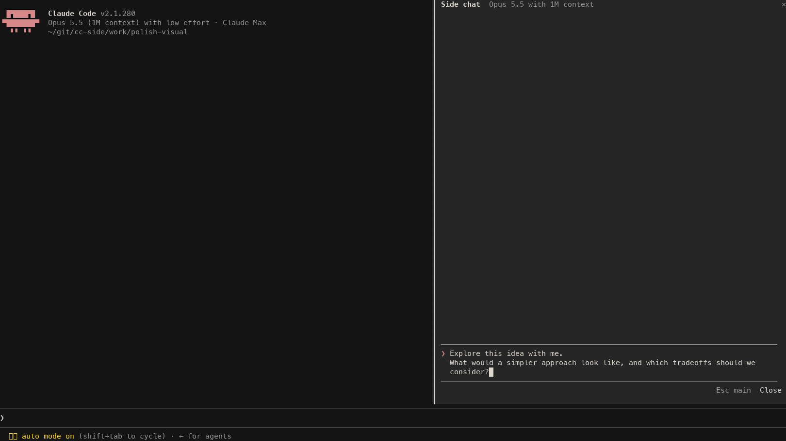

# cc-side

A temporary side chat for Claude Code. Run `/side` to open a second conversation
on the right, with the main chat's context and its own tools, model, and follow-ups.
Closing it discards the conversation.



## Setup

Requires macOS, [Bun](https://bun.sh), a Homebrew installation of Claude Code,
and an existing Claude login. Tested with Claude Code **2.1.280** and Bun **1.2.23**.
Mods are experimental; other runtime versions may need changes.

```sh
brew install --cask claude-code
bun install --frozen-lockfile
bun run dev
```

Run those commands from this checkout. To work in another directory, run
`/path/to/cc-side/scripts/dev.sh` there. The launcher enables fullscreen rendering
and function hooks for that process. Use a terminal at least 110 columns wide.

## Usage

- `/side` opens the pane; `/side your question` opens it and sends a question.
- Click the composer to type. Enter sends; Shift+Enter adds a line.
- Type `/` for commands and project skills. `/model` and `/effort` affect only the side.
- Tools request approval in the pane. Stop interrupts the current reply.
- Escape returns to main. Close, ×, or `/side close` discards the side chat and draft.
- A rejected `/side` question returns to the main prompt for retry. It is not queued.

The pane resizes with the terminal. A manually saved Claude pane width overrides
its automatic sizing.

## Limits

- **Paste is not supported reliably.** Claude can route pasted text to the main
  prompt even after clicking the side editor. The current Mods API lacks paste
  and focus-loss events. Initial keyboard focus also requires a click.
- Context is a saved snapshot from when the pane opens. Later main messages are
  not synchronized. An empty main chat starts a fresh side conversation.
- The first side request can miss the parent's prompt cache. A measured SDK fork
  read 0 cached tokens and wrote 19,952; its next follow-up read 20,143. Opening a
  pane alone makes no model request. `/side stats` shows per-request cache usage.
- The chats share a working directory: file changes survive closing the side.
  The child transcript is not resumable, but tool files and configured logging
  can persist. Session-only permissions and CLI-only settings are not all inherited.
- This is a macOS prototype. Long histories, attachments, every Claude command,
  and other terminals/platforms have not been exhaustively tested.

See [CONTRIBUTING.md](CONTRIBUTING.md) for the code layout and tests.

MIT licensed. An unofficial project, not affiliated with Anthropic.
