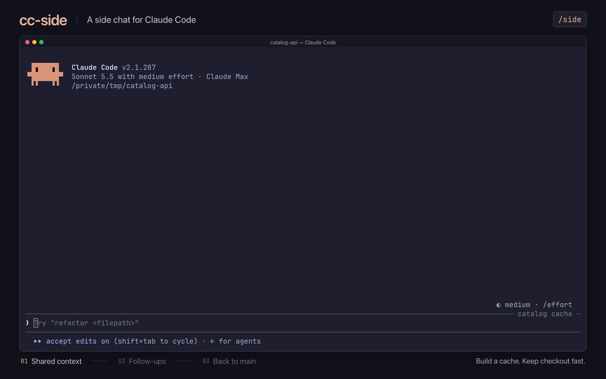

# cc-side

A side chat for Claude Code. `/side` opens a second conversation beside the main one,
starting from the main chat's context. Ask questions, review code, or try an idea while
the main agent keeps working, without adding any of it to the main conversation.
Closing the side discards it.



## Quick start

You need Claude Code 2.1.287 or later, Node.js 18+ or Bun, and a terminal at least
110 columns wide, on macOS, Linux, or Windows.

1. Install the plugin:

   ```sh
   claude plugin marketplace add Ahmad8864/cc-side
   claude plugin install cc-side@cc-side
   ```

2. In Claude Code, turn on the fullscreen renderer once: `/tui fullscreen`.
3. Run `/side`, or `/side <question>` to ask straight away.

## Using it

| Input              | Does                                                           |
| ------------------ | -------------------------------------------------------------- |
| Click the composer | Type in the side. Enter sends; Shift+Enter adds a line         |
| `/`                | Side commands, plus Claude Code's own commands and your skills |
| `@`                | Mention a file or folder; Tab inserts it (in a git repository) |
| ↑ ↓                | Pick a suggestion, or bring back a message you sent            |
| Esc                | Back to main                                                   |
| Click a tool row   | Expand its details                                             |

| Command                 | Does                                                                                                            |
| ----------------------- | --------------------------------------------------------------------------------------------------------------- |
| `/model`, `/effort`     | Change the side's model or effort; main keeps its own                                                           |
| `/edit on`, `/edit off` | Allow or block file edits. Side chats start read-only and remember your choice; the header badge toggles it too |
| `/refresh`              | Catch up to main's latest point, keeping this discussion. A `main is 2 replies ahead` hint offers it            |
| `/insert`               | Put the last reply into main's prompt                                                                           |
| `/copy`                 | Copy the last reply                                                                                             |
| `/stop`                 | Stop the current reply (or press Stop)                                                                          |
| `/close`                | Discard the side chat (or ×, or `/side close` from main)                                                        |

## How it works

- **Context.** The side sees main's conversation up to when you opened or refreshed it;
  from an empty main chat it starts fresh. A refresh brings the side's questions and
  answers along as text, without their tool results.
- **Tools.** Claude asks for approval in the pane, showing edits as diffs. Read-only mode
  blocks Claude's file-editing tools, but shell commands follow your usual approval
  rules, so an allowed command can still write files.
- **Files.** Both chats work in the same folder, so file changes outlast the side. The
  side's own transcript isn't saved.
- **Cost.** Opening the pane makes no model request. With the same model and effort as
  main, the side reuses main's prompt cache: a measured Sonnet fork read 51,774 cached
  tokens and wrote 336. `/side stats` totals the side's cache use.
- **Layout.** The pane resizes with the terminal, unless you saved a pane width in Claude.

## Limits

- **Paste lands in main.** Mods has no paste or focus events yet, so type in the side
  after clicking it.
- **Mentioned files aren't listed** under your message as in main; Claude Code doesn't
  report what it attached.
- **Permission and sandbox settings are copied when the pane opens.** Session-only rules,
  CLI tool restrictions, and later mode changes may not carry over.
- **`/side <question>` doesn't queue.** If the side is busy, the question goes back to
  your prompt.
- **It's a prototype,** used mostly on macOS and tested with Claude Code 2.1.287. Mods
  APIs can change between releases; long histories, attachments, and other terminals
  are lightly tested.

[Contributing](CONTRIBUTING.md) · MIT licensed; bundled components keep their own
[licenses](licenses/) · Unofficial, not affiliated with Anthropic
